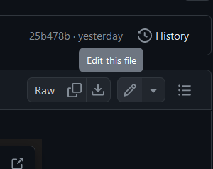
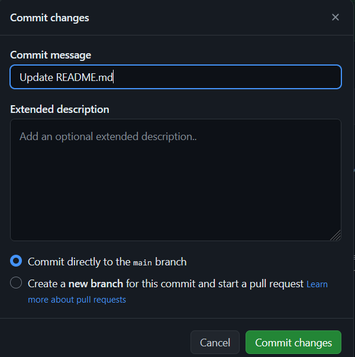
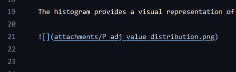
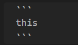
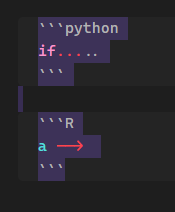
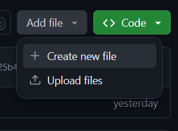
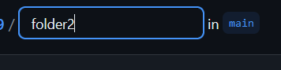
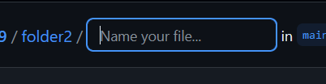
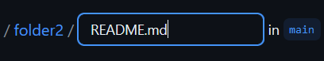
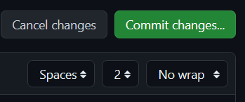

## Make a nice main page
Referance vedio-->

```cardlink
url: https://www.youtube.com/watch?v=LuBXYYEyv88
title: "Create stunning GitHub Profile!"
description: "Why one should have a GitHub profile?There are several reasons why having a GitHub profile can be beneficial:Demonstrating your skills and experience: A GitH..."
host: www.youtube.com
favicon: https://www.youtube.com/s/desktop/050e6796/img/favicon_32x32.png
image: https://i.ytimg.com/vi/LuBXYYEyv88/maxresdefault.jpg
```

create repository -->(name should be the same as the username) + README.md file
[this is a special kind of repository in GItHUb]

create your profile using ⬇️ website

```cardlink
url: https://gprm.itsvg.in/
title: "GPRM : GitHub Profile ReadMe Maker"
description: "Best Profile Generator, Create your perfect GitHub Profile ReadMe in the best possible way. Lots of features and tools included, all for free !"
host: gprm.itsvg.in
favicon: https://gprm.itsvg.in/logo.png
image: https://gprm.itsvg.in/webimg.png
```

copy code-- and paste it in README.md file inside the repository you just created


then save it using "commit changes..." 





---

## What is .md file

It is like a .txt file with some extra functionality.
md - markdown

### How to add images inside the .md file

type this

```

```

change the path_to_the_image to either the image location(inside the repository)


the attachment folder is adjacent to the .md file containing the code.
(or)                       
you can paste the web link if the image is from web.

Note: the file name should not contain spaces(insted use ' _ ' )

---
### How to add code blocks

like
```
this
```

start with 3 backticks and end with 3 backticks

you can even specify the type of code it is.......

```python
if.....
```

```R
a --> 
```
by adding the type after the starting backticks


---
### How to add a line

3 times  "-"

----
## How to make a folder within a folder in Github

create new file --> 


type folder name in the file name then add / 
 
the will be a jump

then make any file (ex: names.py, file.txt, )

commit changes



---
